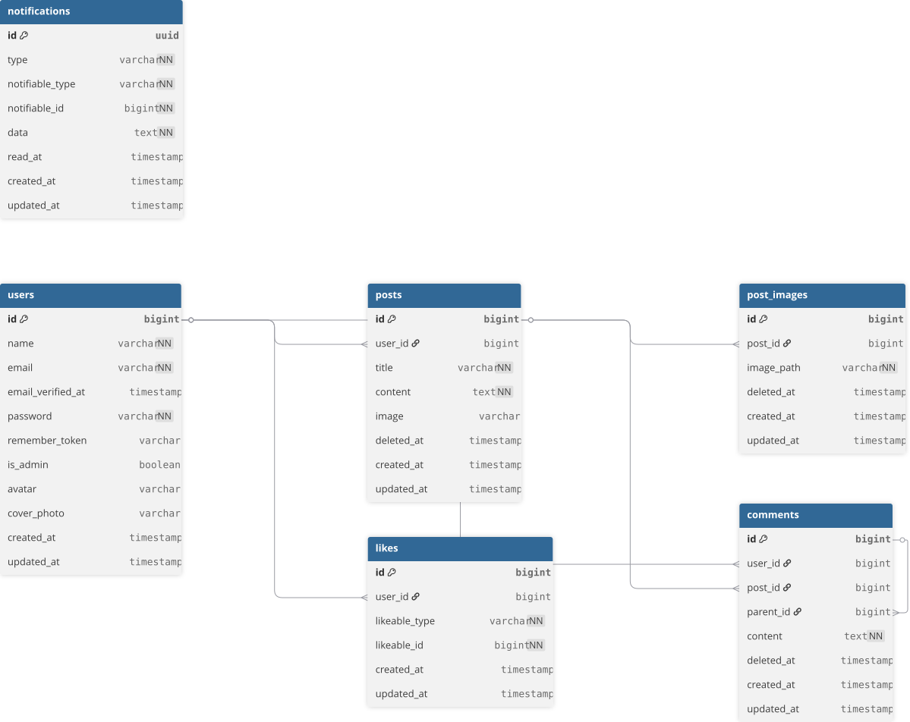

<div align="center">

# 🚀 Mini Forum

**A Modern Community Platform built with Laravel 11, React (Inertia), and PostgreSQL**

[](https://laravel.com)
[](https://reactjs.org)
[](https://tailwindcss.com)
[](https://inertiajs.com)
[](https://www.postgresql.org/)
[](https://redis.io)
[](https://supabase.com/)
[](https://render.com/)
[](https://pusher.com/)

ระบบคอมมูนิตี้ฟีด / เว็บบอร์ดขนาดย่อมที่เน้นความรวดเร็วและประสบการณ์ผู้ใช้ (UX) ที่ลื่นไหลเหมือน SPA  
พร้อมระบบฝากรูปภาพบน Cloud และการทำงาน Real-time แบบ Hybrid (Reverb สำหรับ Local และ Pusher สำหรับ Production)

</div>

---
## 🌐 Live Demo
ลองใช้งานระบบจริงได้ที่นี่: <a href="https://tuna-forum.onrender.com" target="_blank"><strong>Mini Forum - Live Preview</strong></a>
> **Note:** เนื่องจาก Deploy บน Render (Free Plan) ตัว Server อาจจะใช้เวลา "Wake up" ประมาณ 30-60 วินาทีในการโหลดครั้งแรก 
---

# ✨ Key Features (ฟีเจอร์เด่น)

- **Infinity Nested Comments** — ระบบคอมเมนต์ซ้อนกันได้ไม่จำกัดชั้น เพื่อการสนทนาที่ลึกซึ้ง
- **Hybrid Real-time Notifications** — แจ้งเตือนทันทีด้วย `Laravel Reverb` (Local) และสลับไปใช้ `Pusher` เมื่ออยู่บน Production
- **Cloud Asset Management** — ระบบจัดการรูปภาพโปรไฟล์และโพสต์ผ่าน `Supabase Storage` (S3 Compatible)
- **Polymorphic Likes** — สถาปัตยกรรม Database ที่ยืดหยุ่น รองรับการกดไลก์ได้ทั้งระดับ Post และ Comment
- **Powerful Admin Panel** — จัดการเนื้อหา สมาชิก และสถิติผ่าน Dashboard ด้วย `Filament PHP v3`
- **Robust Security** — ระบบสมาชิกและการจัดการเซสชันที่ปลอดภัยผ่าน `Laravel Built-in Authentication (Session-based)`

---

# 🛠️ Tech Stack

## Backend & Frontend

- **PHP 8.4** (Containerized)
- **Laravel 11**
- **React 18 + Inertia.js**
- **Tailwind CSS**
- **Filament PHP 3.2** (Admin Panel)

## Infrastructure & Storage

- **Docker (Laravel Sail)** สำหรับจำลอง Environment ให้เหมือนกันทุกเครื่อง
- **PostgreSQL 18** (Primary Database)
- **Redis** (Caching & Sessions)
- **Supabase Storage** สำหรับเก็บ Assets บน Cloud เพื่อความเสถียรระดับ Production
- **Render** สำหรับ Deploy ระบบขึ้น Cloud
- **Pusher** Cloud-based WebSocket Service ที่ใช้เป็น Production Driver สำหรับระบบ Real-time เพื่อข้ามขีดจำกัดเรื่องการคงสภาพการเชื่อมต่อบน Cloud Platform (เช่น Render) ทำให้การแจ้งเตือนเสถียร 100%

---

# 💻 การติดตั้งและการรันโปรเจกต์ (Local Development)

## 📌 สิ่งที่ต้องเตรียม

1. [WSL 2](https://learn.microsoft.com/en-us/windows/wsl/install) (สำหรับ Windows Users)
2. [Docker Desktop](https://www.docker.com/products/docker-desktop/)

---

## 🚀 ขั้นตอนการติดตั้ง

### 1. Clone Project & Install Dependencies

```bash
git clone https://github.com/SoponSaenkaew/mini-forum.git
cd mini-forum

# ติดตั้ง Composer dependencies ผ่าน Container ชั่วคราว
docker run --rm \
    -u "$(id -u):$(id -g)" \
    -v "$(pwd):/var/www/html" \
    -w /var/www/html \
    laravelsail/php84-composer:latest \
    composer install --ignore-platform-reqs
```

---

### 2. Environment Configuration

```bash
cp .env.example .env
```

> **Note:**  
> หากต้องการใช้งานระบบอัปโหลดรูปภาพผ่าน Supabase  
> ต้องตั้งค่า `FILESYSTEM_DISK=supabase`  
> และระบุค่า `SUPABASE_STORAGE_URL`, `SUPABASE_STORAGE_KEY` ในไฟล์ `.env`

---

### 3. Start Containers & Setup Database

```bash
./vendor/bin/sail up -d
./vendor/bin/sail artisan key:generate
./vendor/bin/sail artisan migrate --seed
./vendor/bin/sail artisan storage:link
```

---

### 4. Frontend & Background Services

เปิด Terminal 3 หน้าต่าง เพื่อรัน Service ต่อไปนี้:

#### Terminal 1 — Vite Dev Server

```bash
./vendor/bin/sail npm install
./vendor/bin/sail npm run dev
```

#### Terminal 2 — WebSocket Server (Reverb)

```bash
./vendor/bin/sail artisan reverb:start --host=0.0.0.0 --port=8081
```

#### Terminal 3 — Queue Worker

```bash
./vendor/bin/sail artisan queue:work
```

---

# 🚀 Production Deployment (Render)

โปรเจกต์นี้ได้รับการปรับแต่งเพื่อรองรับการ Deploy ผ่าน Docker บน Render อย่างสมบูรณ์

- **Dockerfile Optimized** — จัดการ Permission ของโฟลเดอร์ `storage` และ `cache` โดยอัตโนมัติ
- **Secure Asset Delivery** — บังคับใช้งาน HTTPS และจัดการ Mixed Content ผ่าน `AppServiceProvider`
- **Hybrid URL Generation** — ระบบ Accessors ใน Model จะสลับ URL ระหว่าง Local และ Cloud อัตโนมัติ

---

# 🌐 การเข้าใช้งาน (Default Accounts)

## Main Application

```text
http://localhost
```

## Admin Panel

```text
http://localhost/admin
```

## Default Accounts

### Admin Account

```text
Email: admin@example.com
Password: password
```

### Test User

```text
Email: user@example.com
Password: password
```

---

## 🗄️ Database Architecture

ระบบฐานข้อมูลถูกออกแบบมาเพื่อรองรับฟีเจอร์คอมมูนิตี้บอร์ดโดยเฉพาะ เน้นความยืดหยุ่น ความเร็ว และความปลอดภัยของข้อมูล

<details>
<summary><b>📊 ดูแผนภาพ ER Diagram (คลิกเพื่อขยาย)</b></summary>



</details>

### 💡 Key Highlights

* **Nested Comments:** ใช้การเรียกตัวเอง (Self-referencing) ผ่าน `parent_id` ในตาราง `comments` เพื่อรองรับการตอบกลับซ้อนกัน
* **Polymorphic Likes:** ตาราง `likes` ใช้โครงสร้าง Polymorphic (`likeable_id`, `likeable_type`) เพื่อเก็บข้อมูลการถูกใจทั้งระดับ "Post" และ "Comment" ในตารางเดียว
* **Soft Deletes:** โพสต์ คอมเมนต์ และรูปภาพ จะถูกประทับเวลาใน `deleted_at` แทนการลบข้อมูลจริง เพื่อป้องกันข้อมูลสูญหายและสามารถกู้คืนได้
* **UUID Notifications:** ตาราง `notifications` ใช้ Primary Key แบบ UUID ตามมาตรฐาน Laravel เพื่อความปลอดภัยจากการถูกคาดเดารหัส

---

## 🔌 API & Routes Reference

การรับส่งข้อมูลใช้มาตรฐาน Session-based และรองรับการทำงานผ่าน CSRF Protection เพื่อความปลอดภัยสูงสุด (เส้นทางส่วนใหญ่ถูกปกป้องด้วย Middleware `auth`)

<details>
<summary><b>📍 ดูเส้นทางทั้งหมด (คลิกเพื่อขยาย)</b></summary>

| Method | Route | Description |
| :--- | :--- | :--- |
| **Posts** | | |
| `GET` | `/` | หน้าแรก (ดึงโพสต์ล่าสุด 3 รายการ) |
| `GET` | `/dashboard` | หน้าฟีดหลัก (รองรับการค้นหาและ Pagination) |
| `POST` | `/posts` | สร้างโพสต์ใหม่ (รองรับการอัปโหลดรูปภาพ) |
| `POST` | `/posts/{post}/like` | กดถูกใจ / ยกเลิกถูกใจ (Polymorphic) |
| **Comments** | | |
| `POST` | `/posts/{post}/comments` | เขียนคอมเมนต์ใหม่ใต้โพสต์ |
| `GET` | `/comments/{comment}/reply`| หน้าตอบกลับความคิดเห็นย่อย (Nested) |
| `POST` | `/comments/{comment}/like` | กดถูกใจ / ยกเลิกถูกใจ คอมเมนต์ |
| **Notifications** | | |
| `GET` | `/notifications` | ดูรายการแจ้งเตือนทั้งหมด |
| `PATCH`| `/notifications/{id}/read` | ทำเครื่องหมายว่าอ่านแล้ว (รายข้อ) |
| `POST` | `/notifications/read-all` | ทำเครื่องหมายว่าอ่านแล้วทั้งหมด |

</details>

---


<div align="center">

<em>Developed with ❤️ by SoponSaenkaew</em>

[](https://github.com/SoponSaenkaew)
[](https://www.linkedin.com/in/your-profile)
[](mailto:soponseankeaw@gmail.com)

</div>

---

## 📄 License

The Mini Forum project is open-sourced software licensed under the [MIT license](https://opensource.org/licenses/MIT).
